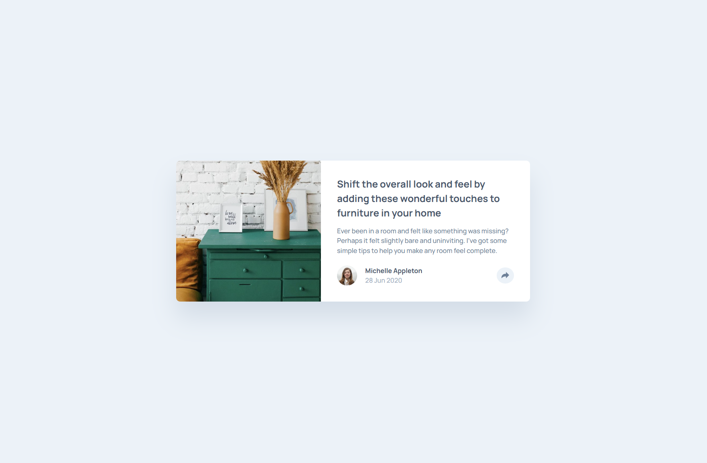

# Frontend Mentor - Article preview component solution

This is a solution to the [Article preview component challenge on Frontend Mentor](https://www.frontendmentor.io/challenges/article-preview-component-dYBN_pYFT). Frontend Mentor challenges help you improve your coding skills by building realistic projects.

## Table of contents

- [Overview](#overview)
  - [The challenge](#the-challenge)
  - [Screenshot](#screenshot)
  - [Links](#links)
- [My process](#my-process)
  - [Built with](#built-with)
  - [What I learned](#what-i-learned)
  - [Continued development](#continued-development)
  - [Useful resources](#useful-resources)
- [Author](#author)

## Overview

### The challenge

Users should be able to:

- View the optimal layout for the component depending on their device's screen size
- See the social media share links when they click the share icon

### Screenshot



### Links

- Solution URL: [GitHub solution repo](https://github.com/LelloX-Dev)
- Live Site URL: [Live site](https://lellox-dev.github.io/article-preview-component/)

## My process

### Built with

- Semantic HTML5 markup
- CSS custom properties
- Flexbox
- CSS Grid
- Mobile-first workflow
- Vanilla JavaScript

### What I learned

This project taught me how to manage dynamic UI behavior based on window width. For example, I learned how to automatically close a modal when the window crosses a specific breakpoint (864px):

```js
let previousWidth = window.innerWidth;
window.addEventListener("resize", () => {
  const currentWidth = window.innerWidth;
  if (shareModal.classList.contains("active")) {
    if (
      (previousWidth < 864 && currentWidth >= 864) ||
      (previousWidth > 864 && currentWidth <= 864)
    ) {
      closeShareModal();
    }
  }
  previousWidth = currentWidth;
});
```

### Continued development

I'd like to explore accessibility enhancements, such as managing focus inside modals and improving keyboard navigation.

### Useful resources

- [MDN Web Docs](https://developer.mozilla.org/) - Great reference for JavaScript DOM manipulation and media queries.
- [Frontend Mentor](https://www.frontendmentor.io) - Excellent platform to sharpen frontend skills with real-world challenges.

## Author

- Frontend Mentor - [@LelloX-Dev](https://www.frontendmentor.io/profile/LelloX-Dev)
- Github - [@LelloX-Dev](https://github.com/LelloX-Dev)
